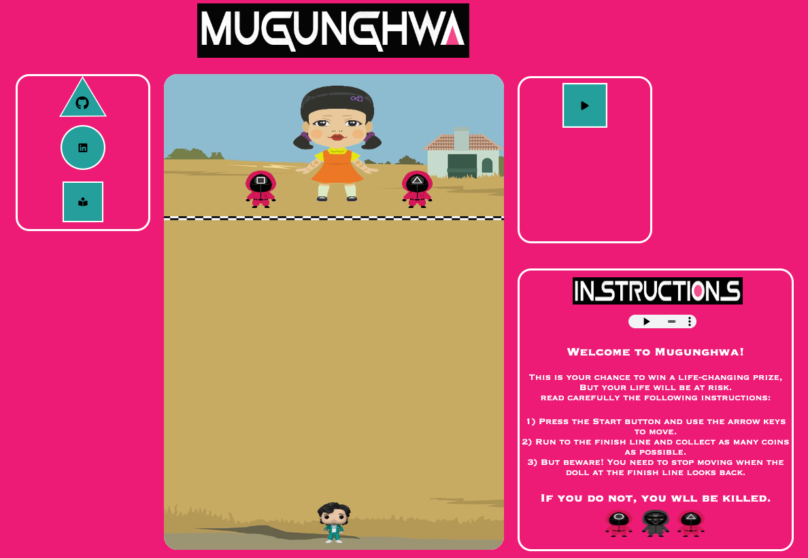
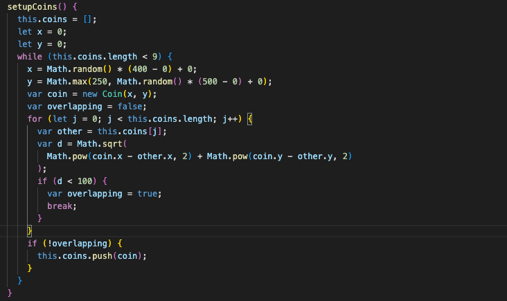
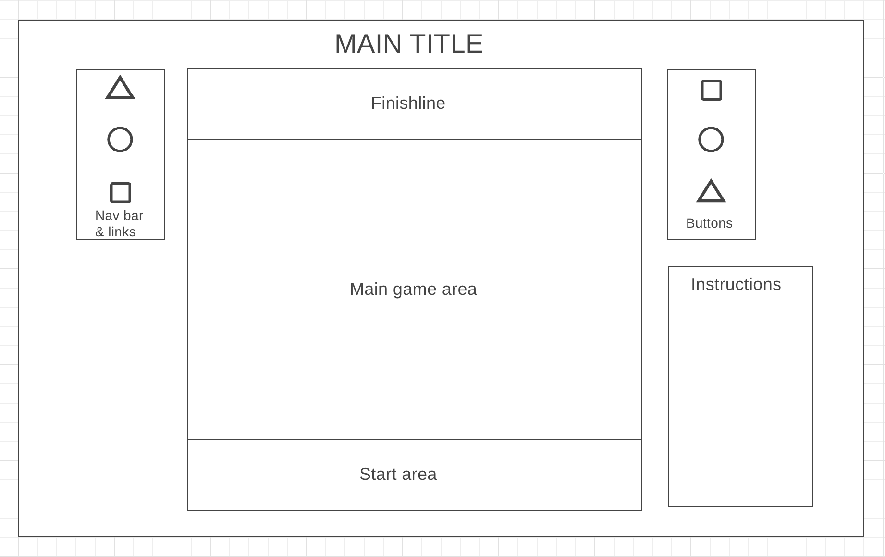

# MUGUNGHWA

###### Why Mugunghwa?

**Mugunghwa kkoci pieot seumnida** also known as  __"Red Light, Green Light"__ from Squid Game on Netflix, is a childhood game widely played in South Korea. The song of "mugunghwa kkoci pieot seumnida" plays during the game. The 'mugunghwa' (hibiscus) is not only the national flower of South Korea but also the meaning of my name. In the song, “kkoci pieot seumnida” means that the flower has bloomed. 

## DESCRIPTION
In the original game, the "it" person sings the song and as soon as they finish singing, they look back and the players must not move. In this game, your goal is to get your player to the finish line and collect as many coins as possible on the way. The "it" person will stand at the finish line. The player can only move when the "it" person doesn't look back. The speed at which the "it" is not consistent every time. Therefore, the player won't be able to predict when to move.

## LIVE
Play [here](https://kkj2010.github.io/Javascript-Project/)!

## FUNCTIONALITIES AND MVPS 
In MUGUNGHWA, the user will be able to:
* Start and restart the game.
* Pressing a specific arrow key causes the character to move at a set speed in that direction.
The character can only move in the main game area.

* Every time a new game starts, coins were specified at a certain distance so that the positions where they were placed did not overlap.

* Collect coins on the way to the finish line 
* See how many coins left in scoreboard.
* Move when the "it" at the finishline looks back.

## TECHNOLOGIES, LIBRARIES & APIS
* JavaScript as the logic and game source code
* HTML Canvas to render the game
* CSS for styling
* Webpack

## WIREFRAME

## Implementation Timeline
* 11/11- 11/13
- [ ] Research Canvas and make a project skeleton
- [ ] Collect images will be used
- [ ] Set player movement

* 11/14
- [ ] Add layout for robot girl
- [ ] Set up pop and all other buttons

* 11/15
- [ ] Add functions for the robot girl 
- [ ] Add music funcion

* 11/16
- [ ] Add links, instructions, and other functionality to game website
- [ ] Add functions that the player can collect coins 
- [ ] Add functions that the player win the game when he arrives final line
- [ ] Debugging, styling, and final touches

* 11/17
- [ ] Deploy to Github pages.