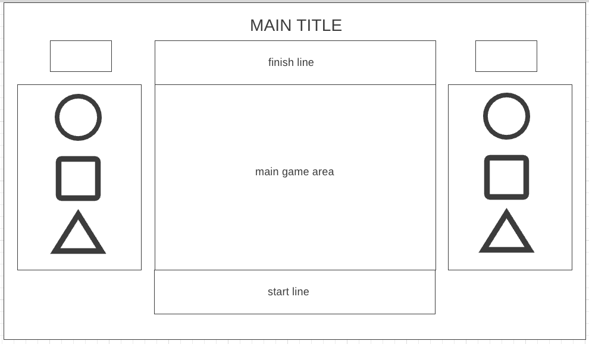

# Welcome to Hibiscus flowers bloomed!(title can be changed)

######  Why Hibiscus flowers bloomed?
**Mugunghwa kkoci pieot seumnida** also known as  __"Red Light, Green Light"__ from Squid Game on Netflix, is a childhood game widely played in South Korea. The song of "mugunghwa kkoci pieot seumnida" plays during the game. The 'mugunghwa' (hibiscus) is not only the national flower of South Korea but also the meaning of my name. In the song, “kkoci pieot seumnida” means that the flower has bloomed. 

## Description
In the original game, the "it" person sings the song and as soon as they finish singing, they look back and the players must not move. In this game, both aspects of both versions (Korean and American) were combined: the red/green light and the representatitve song.

Your goal is to get your player to the finish line. The "it" person will stand at the finish line. The player can only move when the "it" person doesn't look back and the light is green. When the player stops moving, the music will stop. The speed at which the "it" player or the red light changes it not consistent every time. Therefore, the player won't be able to predict when to move.

## Functionalities and MVPs
* Start and restart the game.
* Set a timer with a time limit to finish the game.
* Use the keys to move chracter.
* Collect rewards after reaching the finish line. 

## Technologies, Libraries, APIs
* JavaScript as the logic and game source code
* HTML Canvas to render the game
* CSS for styling
* Webpack

<!-- ## Wireframe
 -->

## Implementation Timeline
* 11/11- 11/13
- [ ] Research Canvas and make a project skeleton
- [ ] Collect images will be used

* 11/14
- [ ] Create map, character, and other objects

* 11/15
- [ ] Add players movement and timer/light/music etc

* 11/16
- [ ] Add links, instructions, and other functionality to game website
- [ ] Debugging, styling, and final touches

* 11/17
- [ ] Deploy to Github pages.